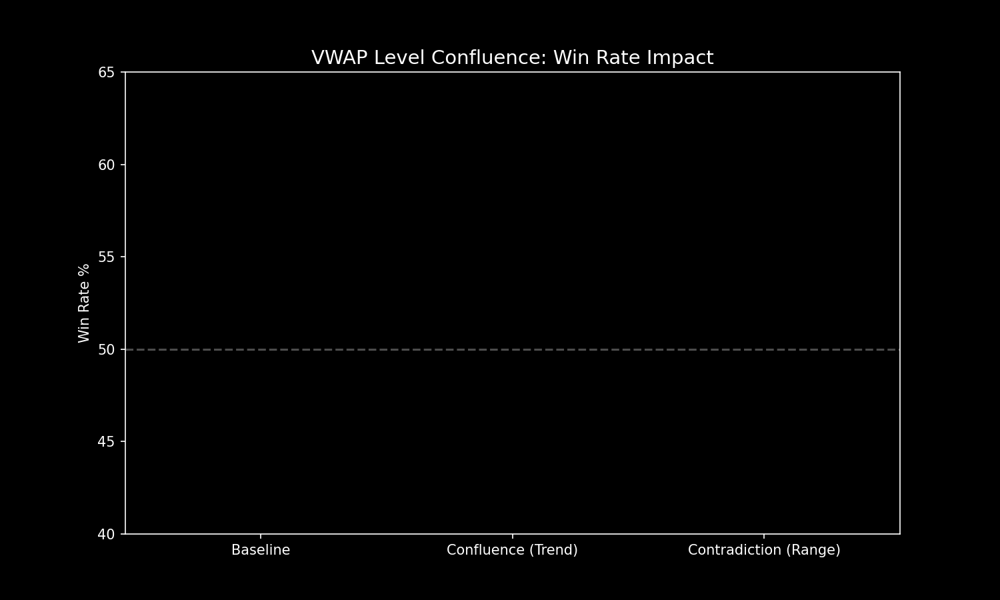
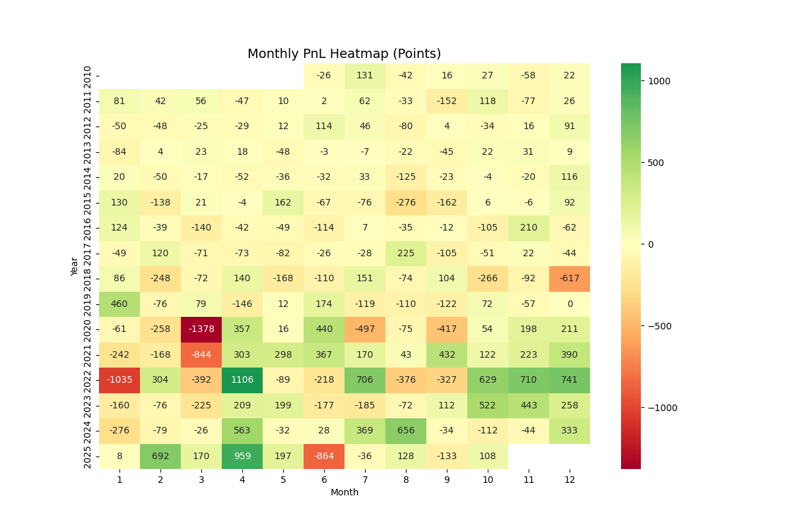

# 📈 Quantitative Trading Research & Systematic Alpha Portfolio

Welcome to my quantitative trading research portfolio. This repository showcases my capabilities in systematic strategy development, statistical arbitrage, market microstructure analysis, and full-stack financial dashboard engineering. It is designed to demonstrate strong engineering practices, statistical rigor, and mathematical modeling to top-tier quantitative trading firms.

---

## 🚀 Key Projects & Visual Demonstrations

Here is a deep dive into the core strategies and analytical engines developed in this portfolio:

### 1. NQ Opening Range Breakout (ORB) with VWAP Confluence
**Description:** A robust 30-minute Opening Range Breakout strategy on Nasdaq futures. Instead of relying on naive price breakouts, this model uses a 4-VWAP Confluence Filter (Current Session VWAP, Prior RTH/ETH VWAPs, and rolling VWAP bands) to dynamically validate breakout momentum. 
* **Key Features:** Machine learning-based noise reduction, asymmetrical risk-reward optimization (e.g., 1.3R Long / 2.5R Short), and zero look-ahead bias.

  
   
  <em>Figure 1: Equity curve demonstrating steady, compounding growth of the NQ 30m ORB strategy across a multi-year backtest.</em>

 

  
   
  <em>Figure 2: VWAP Confluence analysis visualizing trade density and edge realization across varying VWAP bands.</em>

---

### 2. Regime-Switching Markov Models & Kalman Filtering
**Description:** Integration of advanced statistical modeling to adapt to changing market conditions. The Kalman filter mathematically smooths intraday pricing noise to reveal true price velocity, while Markov chains detect high/low volatility regimes to dynamically scale position sizing.

  
   
  <em>Figure 3: Master strategy plot combining Kalman-filtered signals with dynamic regime adjustment, significantly reducing drawdown periods.</em>

---

### 3. Factor Analysis & Risk Metrics (Monte Carlo Simulations)
**Description:** A rigorous quant doesn't just look at a single backtest path. This module runs thousands of Monte Carlo simulations to stress-test the equity curve, calculate the probability of ruin, and determine the optimal Kelly criterion for capital allocation.

  
   
  <em>Figure 4: 1,000-iteration Monte Carlo stress-testing of strategy returns to validate statistical robustness against tail events.</em>

 

  
   
  <em>Figure 5: Monthly returns heatmap showing consistent alpha generation across varying macroeconomic environments.</em>

---

### 4. Full-Stack Financial Dashboards & Data Engineering
**Description:** A quant must handle raw data efficiently. This portfolio includes highly optimized Databento tick-level parsers, anomaly detection scripts, and custom React/Flask interactive web dashboards for real-time visualization of order flow and options pricing (Greeks).
* **ETF Dividend Analyzer:** A Flask/VanillaJS application that simulates long-term DRIP (Dividend Reinvestment) vs. non-DRIP compounding using real-time Yahoo Finance data.
* **Earnings Volatility Monitor:** Real-time tracking of implied vs. realized volatility.

  
   
  <em>Figure 6: Visualizing the alpha generated by the portfolio strategies compared to the standard S&P 500 benchmark.</em>

---

## 📁 Repository Architecture

The repository is structured to reflect a professional institutional environment:

* **`strategies/`**: Core trading logic, pine-script prototypes, and python-based historical backtesting engines.
* **`research/`**: Factor analysis, statistical significance testing, and Jupyter-style exploratory data analysis.
* **`data_pipeline/`**: Robust data engineering scripts for Databento tick processing, Yahoo Finance fetching, and missing-data imputation.
* **`analytics_and_viz/`**: Matplotlib/Plotly generators responsible for rendering all the charts and heatmaps shown above.
* **`reports/`**: Output directory for HTML/PNG backtest reports, trade logs, and performance metrics.
* **`dashboards_and_apps/`**: Production-ready web applications (React, Next.js, Flask) for interactive financial analysis.

---

## 🛠️ Technology Stack

* **Quantitative Research & Math:** Python, Pandas, NumPy, Scikit-Learn, SciPy, Statsmodels.
* **Data Infrastructure:** Databento (BBO & Tick data), yfinance, Parquet, SEC Edgar API.
* **Data Visualization:** Matplotlib, Plotly, Seaborn.
* **Software Engineering:** Object-Oriented Python, React, Flask, Git Version Control.

---

## 📬 Contact & Review

Please explore the `.py` files within the `strategies/` and `research/` directories to examine the mathematical foundations and clean code structure. I am highly passionate about systematic trading and welcome the opportunity to discuss my methodology in depth.
