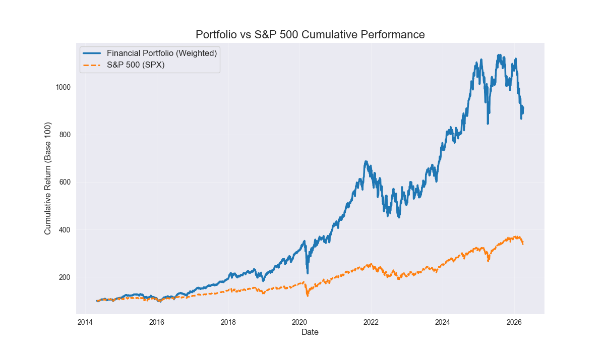

# ETF Dividend Reinvestment Analyzer (DRIP Simulator)

A highly optimized financial simulation web application designed to backtest and visualize the compounding effects of Dividend Reinvestment Plans (DRIP) across major ETFs.

  

*(Actual strategy simulation vs SPX benchmark plot)*

## 📌 Technical Overview
This standalone application solves the complex problem of accurately backtesting total return vs. price return by mathematically aligning dividend ex-dates with end-of-day pricing to simulate exact DRIP compounding.

### Features
* **DRIP vs No-DRIP Comparison**: Isolates the performance delta generated purely from reinvesting dividends versus holding cash.
* **Tax Bracket Adjustments**: Dynamically simulates the drag of dividend taxation on long-term compound annual growth rate (CAGR).
* **Metrics Calculation**: Computes critical quantitative metrics including CAGR, Average Yield, and Net Total Return.

## 🛠️ System Architecture
* **Backend Pipeline**: Flask (Python), Pandas, NumPy, yfinance.
* **Frontend Visualization**: Vanilla Javascript, Chart.js, Glassmorphism CSS.
* **Data Engineering**: Chronological index alignment, timezone normalization, and NA imputation for edge-case market days.
