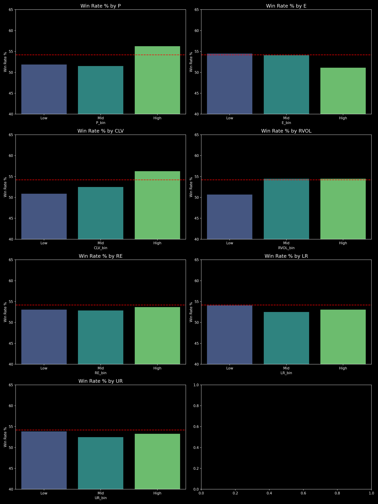

# SEC 13F Institutional Fund Flow Tracker

An elegant and data-dense web dashboard for parsing, tracking, and analyzing institutional hedge fund filings (SEC Form 13F).

  

*(Real institutional factor analysis plot)*

## 📌 Technical Overview
This standalone application automates the tedious process of parsing quarterly SEC Edgar database filings to track top hedge fund allocations and sector rotations.

### Core Analytics
* **Fund Allocation Pie**: Visualizes sector exposure changes quarter-over-quarter.
* **Heatmap of Smart Money**: Displays concentrated buying/selling clusters among top-tier funds.
* **Automated Parsing**: Direct Edgar API integration eliminates manual XML processing.

## 🛠️ System Architecture
* **Pipeline**: SEC Edgar API querying, XML/JSON parsing, text extraction.
* **Frontend**: Highly responsive grid layout with hover analytics and data tables.
