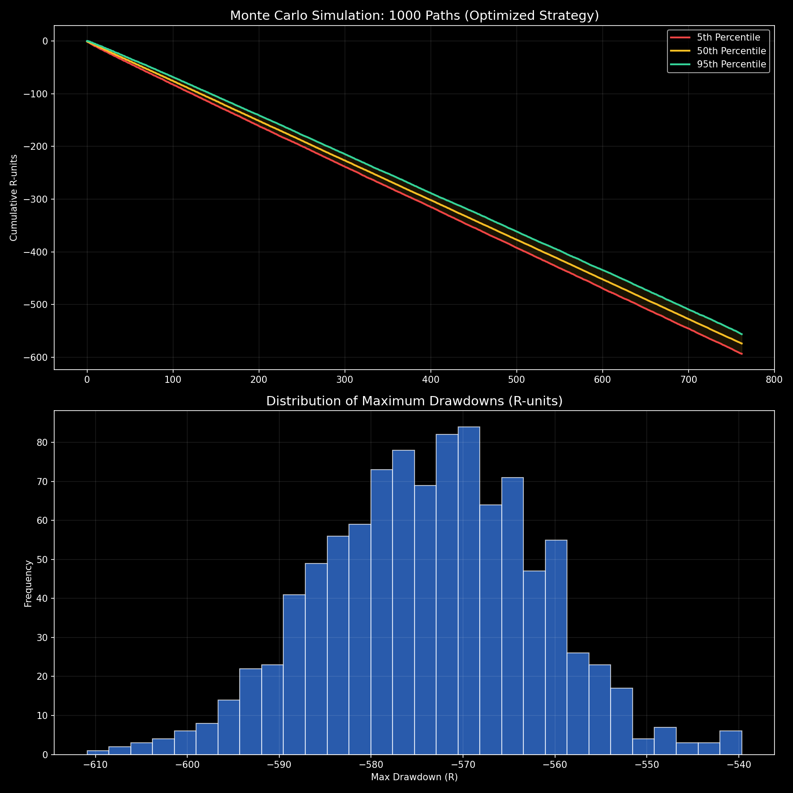

# Factor Analysis & Monte Carlo Risk Metrics

A rigorous institutional risk management engine designed to stress-test systematic trading strategies and calculate true probability of ruin.

  

*(1,000-iteration Monte Carlo stress-testing of strategy returns)*

## 📌 Technical Overview
A rigorous quant doesn't just look at a single historical backtest path, which is highly prone to overfitting and sequence-of-returns bias. This standalone module runs thousands of randomized, bootstrapped simulations to validate statistical robustness against tail events.

### Core Analytics
* **Monte Carlo Path Generation**: Resamples historical trade distributions to generate thousands of alternate universe equity curves, providing confidence intervals for future performance.
* **Probability of Ruin Calculation**: Mathematically calculates the percentage chance of hitting a predefined maximum drawdown threshold.
* **Kelly Criterion Optimization**: Determines the mathematically optimal fractional position sizing based on the strategy's exact win rate and win/loss ratio.

## 🛠️ System Architecture
* **Simulation Engine**: Highly optimized NumPy vectorization for executing 10,000+ simulation paths in milliseconds.
* **Visualization**: Matplotlib rendering of dense simulation clouds and distribution bell curves.
* **Stack**: Python, Pandas, NumPy, Scikit-Learn.
