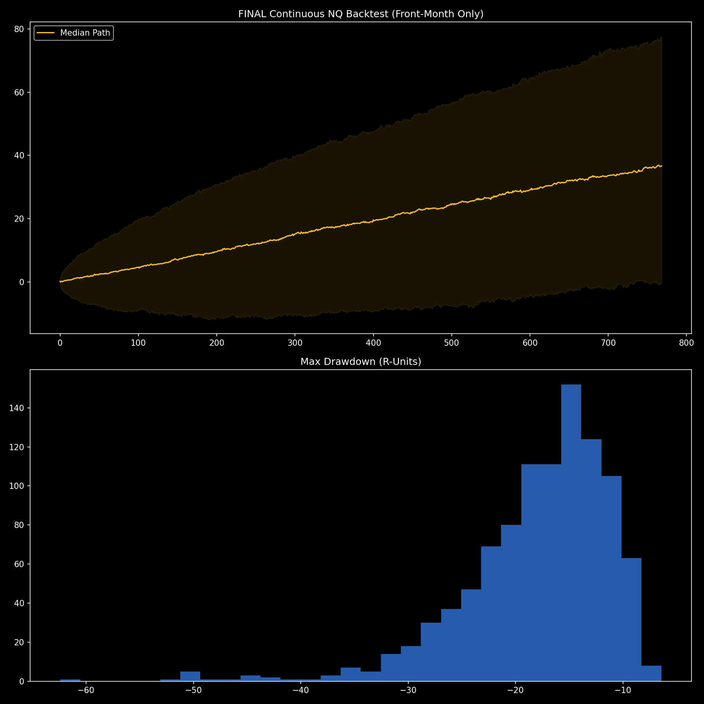

# Regime-Switching Markov Models & Kalman Filtering

An advanced quantitative statistical arbitrage framework integrating dynamic market regime detection with noise-canceling signal processing.

  

*(Master strategy plot combining Kalman-filtered signals with dynamic regime adjustment)*

## 📌 Technical Overview
Financial time series are notoriously noisy and non-stationary. This module solves two critical problems in algorithmic trading: identifying true price velocity (Signal vs. Noise) and identifying the current macroeconomic state (Regime).

### Core Mathematical Components
* **Kalman Filtering**: Applies a linear quadratic estimation algorithm to mathematically smooth intraday pricing noise and reveal true, latent price velocity without the lag associated with traditional moving averages.
* **Hidden Markov Models (HMM)**: Uses probabilistic state machines to detect high vs. low volatility regimes. The algorithm dynamically scales position sizing up during predictable low-volatility regimes and scales down during erratic high-volatility regimes.
* **Drawdown Reduction**: By combining these two mathematical models, the strategy avoids false signals during chop and captures massive asymmetrical edge during trending phases.

## 🛠️ System Architecture
* **Stack**: Python, SciPy, Scikit-Learn, Statsmodels.
* **Data Processing**: Tick-level aggregation into state spaces for the HMM transition matrices.
