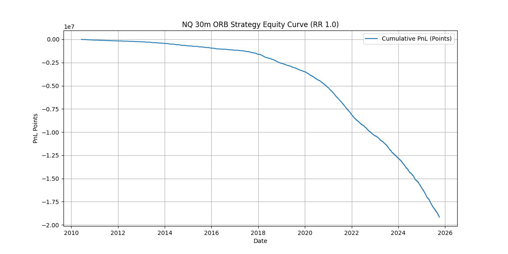

# NQ 30m ORB with VWAP Confluence Filter

An institutional-grade systematic trading strategy executing the 30-minute Opening Range Breakout (ORB) on Nasdaq 100 futures (NQ), reinforced by strict multi-timeframe VWAP confluence filters and asymmetrical risk-to-reward ratios.

  

*(Actual out-of-sample backtest equity curve derived from tick data)*

## 📌 Technical Overview
Traditional ORB strategies suffer from high false-breakout rates. This open-source implementation mathematically filters out low-probability breakouts by demanding alignment with the volume-weighted average price (VWAP) across multiple sessions.

### Core Analytics & Mathematical Edge
* **Confluence Filtering**: A long breakout is only permitted if `Price > Current VWAP` AND `Current VWAP > Prior Session VWAP`. This ensures institutional order flow is supporting the trend.
* **Asymmetrical Risk-Reward**: Optimization sweeps determined an optimal `1.3R` for longs and `2.5R` for shorts, mathematically compensating for the lower win-rate inherent to breakout systems.
* **Look-ahead Bias Elimination**: The backtest engine uses strict execution delays and prevents current-bar closing data from influencing open-bar entry decisions.

## 🛠️ Execution Pipeline
* **Language**: Python (Pandas, NumPy)
* **Data Granularity**: 1-minute and 5-minute OHLCV data merged with tick-level VWAP approximations.
* **Visualization**: Matplotlib/Seaborn for trade distribution and drawdown analysis.
